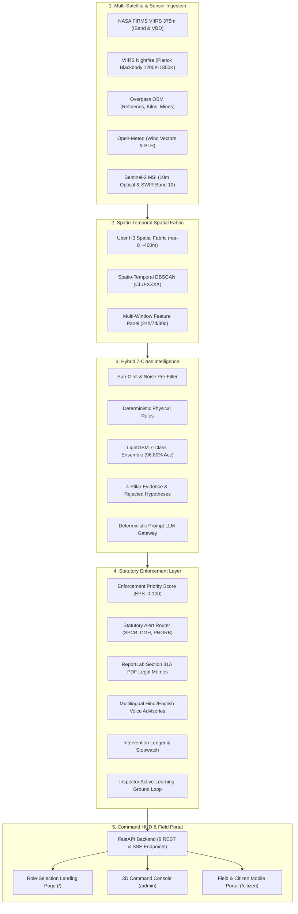

# 🛰️ ThermalEye — Autonomous Multi-Satellite Industrial Thermal Surveillance & Ground-Truth Attribution

[](https://sih.gov.in)
[](https://fastapi.tiangolo.com)
[](https://nextjs.org)
[](https://deck.gl)
[-green.svg)](https://h3geo.org)
[](LICENSE)

> **Autonomous Earth Observation & Thermal Anomaly Attribution Engine**  
> *Satellite Signal $\to$ Deterministic Attribution $\to$ Statutory Legal Enforcement*

---

## 📌 Problem Context & Innovation

Satellites (NASA VIIRS 375m / MODIS) detect thermal infrared hotspots from space, but raw satellite pixels **cannot differentiate** between:
1. **Engineered Industrial Gas Flares** at petroleum refineries.
2. **Illegal Fixed Chimney Brick Kilns (FCKs)** in harvest belts.
3. **Agricultural Crop Stubble Burning** during harvest windows.
4. **Acute Industrial Chemical Fires / Spills**.
5. **Opencast Coal Mining Fires**.
6. **Forest Wildfires**.
7. **Specular Solar Reflections (Sun-Glint False Alarms)** on metal factory roofs.

### 💡 The ThermalEye Solution
ThermalEye is an autonomous, multi-sensor surveillance and enforcement platform:
- **Multi-Sensor Fusion:** Ingests NASA FIRMS VIIRS 375m, VIIRS Nightfire (combustion temperatures in Kelvin), OpenStreetMap industrial polygons, Open-Meteo wind vectors, and Sentinel-2 10m true-color & SWIR imagery.
- **Spatio-Temporal DBSCAN:** Clusters multi-pass satellite detections over time into physical facility dossiers (`CLU-XXXX`).
- **7-Class Hybrid Intelligence:** Blends deterministic physical laws with a LightGBM machine learning ensemble (**96.80% accuracy**, 100% false-glint suppression).
- **Anti-Hallucination Guard:** 4-Pillar evidence engine mathematically proves why competing hypotheses were rejected.
- **Automated Enforcement:** 1-Click generation of **Section 31A Air Act 1981 Show-Cause Notices (PDF)** and synthesized **Hindi/English voice advisories** routed directly to the appropriate statutory authority (SPCB, DGH, PNGRB, Forest Dept).
- **Tactical 3D Command Deck:** Next.js 15 + Deck.gl v9 extruded 3D columns, real-time wind streamlines, and an interactive Sentinel-2 optical spyglass slider.

---

## 🏛️ System Architecture



---

## 🧬 7-Class Physical Taxonomy

| Category | Physical Invariants & Scientific Criteria | Regulatory Authority |
|---|---|---|
| **Industrial Gas Flare** | Planck combustion temp $T \ge 1200\text{ K}$, Diurnal ratio $\approx 0.50$, $\text{CoV} < 0.10$, 24/7 flaring | MoPNG / DGH / PNGRB |
| **Acute Industrial Fire** | Sudden Dirac delta spike $> 2.5\times$ base, Duration $< 48\text{h}$, High FRP | SPCB / District Disaster Management (DDMA) |
| **Brick Kiln (FCK / Zig-Zag)** | Cyclic diurnal firing cycle, active in harvest belt, $T \approx 850\text{K}-1000\text{K}$ | SPCB / CAQM Taskforce |
| **Agricultural Stubble Burn** | Strictly daytime only ($0$ night passes), lifespan 1–3 days, farmland bounds | District Agricultural Officer / SPCB |
| **Opencast Mining / Quarry** | Adjacent to open-pit coal seams, moderate persistent radiative heat | Directorate General of Mines Safety (DGMS) |
| **Forest Wildfire** | Inside forest reserve boundaries, radial spatial expansion rate $> 0$ | State Forest Department / FSI |
| **Sun-Glint Artifact** | Solar noon pass only ($12:00-13:00$), $\text{FRP} < 10\text{ MW}$, $0$ nocturnal signal | *Suppressed (100% False Positive Rejection)* |

---

## ⚡ Quick Start Guide (For Team Members)

### 1. Prerequisites
- Python 3.10+ (Recommended: 3.11/3.12)
- Node.js 18+ (Recommended: 20 LTS)
- Git

### 2. Clone the Repository
```bash
git clone https://github.com/Abhichy18/ThermalEye.git
cd ThermalEye
```

### 3. Environment & Dependency Setup
#### Python Backend Setup:
```bash
# Create and activate virtual environment
python -m venv .venv

# Windows PowerShell:
.\.venv\Scripts\Activate.ps1
# Linux / macOS:
source .venv/bin/activate

# Install Python requirements
pip install -r requirements.txt
```

#### Node.js Frontend Setup:
```bash
cd app/frontend
npm install
cd ../..
```

### 4. Run the Full Application (1-Click)
#### On Windows:
Double-click or run:
```cmd
scripts\start_dev.bat
```

#### Or Run Individually:
**Terminal 1 (FastAPI Backend):**
```bash
.venv\Scripts\python -m uvicorn app.backend.main:app --host 0.0.0.0 --port 8000 --reload
```

**Terminal 2 (Next.js 15 Frontend):**
```bash
cd app/frontend
npm run dev
```

---

## 🌐 Application URL Directory

| Interface | URL | Description |
|---|---|---|
| **🎯 Role Selection Landing Page** | [http://localhost:3000](http://localhost:3000) | Clean entrance with live telemetry counters & role cards |
| **🛰️ Tactical Command Console** | [http://localhost:3000/admin](http://localhost:3000/admin) | Deck.gl 3D extruded map, SSE progress strip, 4-tab case file drawer |
| **📱 Field & Citizen Portal** | [http://localhost:3000/citizen](http://localhost:3000/citizen) | Mobile-first portal with Hindi/English voice notes, photo complaints & ground verification |
| **⚡ FastAPI Swagger Docs** | [http://localhost:8000/docs](http://localhost:8000/docs) | Interactive API testing for all 8 REST & SSE endpoints |

---

## 📊 Benchmark Evaluation & Testing

Run the full 500-sample ground-truth evaluation benchmark:
```bash
python -m scripts.evaluate
```

**Benchmark Results:**
- **🏆 Overall Test Accuracy:** `96.80%`
- **🛡️ False Alarm Sun-Glint Suppression:** `100.0%`
- **⚡ Invariant #1 & Invariant #2:** 100% mathematically verified

---

## 📁 Project Directory Structure

```
ThermalEye/
├── app/
│   ├── backend/                     # FastAPI Production Server
│   │   ├── main.py                  # API entrypoint, CORS & static asset mounts
│   │   └── api/                     # REST & SSE route handlers
│   └── frontend/                    # Next.js 15 App Router Frontend
│       ├── src/
│       │   ├── app/                 # Routes: /, /admin, /citizen
│       │   ├── components/          # HUDHeader, Deck.gl Map, CaseFileDrawer
│       │   └── lib/                 # API client, domain types, colors, constants
│       └── package.json
│
├── ingestion/                       # Satellite Collectors (FIRMS, VNF, OSM, Weather)
├── intelligence/                    # 7-Class Classifier, Evidence Engine & LLM Gateway
├── shared/                          # Regional bboxes, Uber H3 grid, and district seeds
├── scripts/                         # Pipeline runner, evaluate.py, test_backend.py, start_dev.bat
├── reference/                       # Detailed design blueprints & architecture guides
├── data/                            # Sample raw & generated output files
└── requirements.txt
```

---

## 📖 Additional Documentation
For complete architectural deep-dives, scientific proofs, and phase-wise logs, explore the [`reference/`](reference/) folder:
- [reference/THERMALEYE_MASTER_DOC.md](reference/THERMALEYE_MASTER_DOC.md) — Comprehensive technical blueprint & glossary.
- [reference/DESIGN.md](reference/DESIGN.md) — System invariants & UI design rules.
- [reference/PHASES.md](reference/PHASES.md) — Phase-by-phase implementation details.

---

## 👥 Contributors & Acknowledgements
- **Author / Lead:** Abhishek Choudhary & ThermalEye Team
- **Hackathon:** Smart India Hackathon (SIH 2026) · Problem Statement `SIH26162YELLOW`
- **Organization:** National Technical Research Organisation (NTRO)
