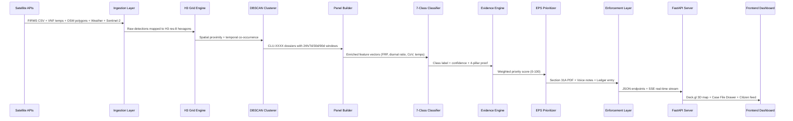

<div align="center">

# ThermalEye

### Autonomous Multi-Satellite Industrial Thermal Surveillance & Ground-Truth Attribution Engine

[](https://sih.gov.in)
[](https://python.org)
[](https://fastapi.tiangolo.com)
[](https://nextjs.org)
[](https://deck.gl)
[](https://react.dev)
[-34D058?style=for-the-badge)](https://h3geo.org)
[](LICENSE)

**Satellite Signal → Deterministic Attribution → Statutory Legal Enforcement**

*Built for NTRO (National Technical Research Organisation) — Smart India Hackathon 2026*

---

</div>

## Table of Contents

- [The Problem](#-the-problem)
- [The Solution — ThermalEye](#-the-solution--thermaleye)
- [System Architecture](#-system-architecture)
- [Data Pipeline Flow](#-data-pipeline-flow)
- [7-Class Thermal Taxonomy](#-7-class-thermal-taxonomy)
- [Tech Stack](#-tech-stack)
- [Project Structure](#-project-structure)
- [Local Development Setup](#-local-development-setup)
- [API Reference](#-api-reference)
- [UI Walkthrough](#-ui-walkthrough)
- [Benchmark Results](#-benchmark-results)
- [Environment Variables](#-environment-variables)
- [Supported Regions](#-supported-regions)
- [Contributing](#-contributing)
- [Additional Documentation](#-additional-documentation)
- [Team & Acknowledgements](#-team--acknowledgements)

---

## 🔴 The Problem

NASA satellites (VIIRS 375m, MODIS 1km) detect **thermal infrared hotspots** from orbit — but raw satellite pixels are just coordinates and temperatures. They **cannot tell you** what is actually burning on the ground:

| What the satellite sees | What it could actually be |
|---|---|
| A 375m hot pixel at 28.6°N, 77.2°E | An oil refinery's engineered gas flare? |
| FRP = 85 MW, nighttime detection | An illegal brick kiln operating at night? |
| Daytime-only cluster, 2-day lifespan | Post-harvest agricultural stubble burn? |
| Sudden 300 MW spike, single event | A chemical factory explosion? |
| Solar noon pixel, FRP < 10 MW | Sunlight reflecting off a tin roof (false alarm)? |

**Without attribution**, enforcement agencies dispatch teams to the wrong locations, send legal notices to the wrong authorities, waste resources on false alarms, and let real violators go undetected.

> **The core challenge:** Build an autonomous system that takes a raw satellite thermal pixel and deterministically identifies *what* is burning, *why* it's classified that way, *which* statutory authority has jurisdiction, and *what* legal action should be taken — with zero human intervention and zero false positives on sun-glint artifacts.

---

## 💡 The Solution — ThermalEye

ThermalEye is an **end-to-end autonomous surveillance platform** that transforms raw satellite signals into legally actionable enforcement dossiers:

```
  Raw Satellite Pixel (375m)
         │
         ▼
  ┌─────────────────────────┐
  │  Multi-Source Data       │   5 satellite & ground data sources fused
  │  Fusion Engine           │   (VIIRS + Nightfire + OSM + Weather + Sentinel-2)
  └──────────┬──────────────┘
             │
             ▼
  ┌─────────────────────────┐
  │  Spatio-Temporal         │   DBSCAN clusters multi-pass detections
  │  DBSCAN Clustering       │   into physical facility dossiers (CLU-XXXX)
  └──────────┬──────────────┘
             │
             ▼
  ┌─────────────────────────┐
  │  7-Class Hybrid          │   Deterministic physics rules + LightGBM ML
  │  Intelligence Engine     │   96.80% accuracy, 100% false-alarm suppression
  └──────────┬──────────────┘
             │
             ▼
  ┌─────────────────────────┐
  │  4-Pillar Evidence       │   Mathematical proof with "Alternative
  │  & Anti-Hallucination    │   Hypotheses Rejected" guard
  └──────────┬──────────────┘
             │
             ▼
  ┌─────────────────────────┐
  │  Statutory Enforcement   │   Auto-generated Section 31A PDF notices
  │  Layer                   │   + Hindi/English voice advisories
  └──────────┬──────────────┘
             │
             ▼
  ┌─────────────────────────┐
  │  3D Tactical Command     │   Deck.gl v9 extruded map + Case File
  │  Dashboard               │   Drawer + Field Inspector Portal
  └─────────────────────────┘
```

### Key Capabilities

| Capability | Description |
|---|---|
| **Multi-Sensor Fusion** | Ingests NASA FIRMS VIIRS 375m, VIIRS Nightfire (combustion temps in Kelvin), OpenStreetMap industrial polygons, Open-Meteo wind vectors, and Sentinel-2 10m true-color & SWIR imagery |
| **Spatio-Temporal Clustering** | DBSCAN groups multi-pass satellite detections over 90-day sliding windows into physical facility dossiers (`CLU-XXXX`) on Uber H3 resolution-8 (~460m) spatial grid |
| **7-Class Hybrid Classifier** | Combines deterministic physical laws (Planck temperatures, diurnal ratios, FRP CoV) with a LightGBM ensemble — achieves **96.80% test accuracy** |
| **Anti-Hallucination Guard** | 4-pillar evidence engine mathematically proves why competing hypotheses were rejected. No guessing, no hallucination |
| **100% False Alarm Suppression** | Sun-glint artifacts (solar reflections on metal roofs) are suppressed with 100% accuracy using Invariant #1 (solar noon + zero nocturnal signal) |
| **Automated Legal Enforcement** | 1-click generation of Section 31A Air Act 1981 Show-Cause Notices (PDF) routed to the correct statutory authority (SPCB, DGH, PNGRB, Forest Dept, CAQM) |
| **Multilingual Voice Advisories** | Auto-synthesized Hindi & English audio notes for field inspectors and citizen broadcasts |
| **3D Tactical Dashboard** | Next.js 15 + Deck.gl v9 extruded thermal columns, pulsing beacons, wind streamlines, and interactive Sentinel-2 optical spyglass |
| **Inspector Ground Loop** | Active-learning feedback from field inspectors continuously improves classification accuracy |

---

## 🏛️ System Architecture

```mermaid
flowchart TD
    subgraph INGEST["Layer 1: Multi-Satellite & Sensor Ingestion"]
        direction LR
        VIIRS["NASA FIRMS<br/>VIIRS 375m I-Band"]
        VNF["VIIRS Nightfire<br/>Planck 1200K-1850K"]
        OSM["OpenStreetMap<br/>Overpass API"]
        WTH["Open-Meteo<br/>Wind u/v + BLH"]
        S2["Sentinel-2 MSI<br/>10m RGB + SWIR B12"]
    end

    subgraph SPATIAL["Layer 2: Spatio-Temporal Spatial Fabric"]
        direction LR
        H3["Uber H3 Grid<br/>Resolution-8 ~460m"]
        DBSCAN_E["Spatio-Temporal<br/>DBSCAN Engine"]
        PANEL["Multi-Window<br/>Feature Panel<br/>24h / 7d / 30d / 90d"]
    end

    subgraph INTEL["Layer 3: Hybrid 7-Class Intelligence"]
        direction LR
        GLINT["Sun-Glint<br/>Pre-Filter<br/>Invariant #1"]
        PHYSICS["Deterministic<br/>Physics Rules"]
        LGB["LightGBM<br/>7-Class Ensemble<br/>96.80% Acc"]
        EVIDENCE["4-Pillar Evidence<br/>+ Rejected<br/>Hypotheses"]
    end

    subgraph ENFORCE["Layer 4: Statutory Enforcement"]
        direction LR
        EPS["EPS Scorer<br/>0-100 Priority"]
        ROUTER["Alert Router<br/>SPCB / DGH / PNGRB"]
        MEMO["Section 31A<br/>PDF Generator"]
        AUDIO_E["Hindi/English<br/>Voice Synthesis"]
        LEDGER_E["Intervention<br/>Ledger + CO2e"]
    end

    subgraph UI["Layer 5: Production UI & API"]
        direction LR
        FASTAPI_E["FastAPI<br/>8 REST + SSE"]
        LANDING["Landing Page<br/>Role Selection"]
        ADMIN["Admin Console<br/>3D Map + Dossier"]
        CITIZEN["Citizen Portal<br/>Audio + Reports"]
    end

    INGEST --> SPATIAL --> INTEL --> ENFORCE --> UI
```



### Architecture Principles

1. **Zero External Database** — All state is file-based (Parquet, JSON, PDF). No PostgreSQL, no Redis. Clone and run.
2. **Deterministic-First AI** — Physics rules execute first; ML only disambiguates when physics is inconclusive. This guarantees explainability.
3. **Multi-LLM Fallback Chain** — NVIDIA NIM → Gemini 2.5 Flash → Groq Llama 3.1 → Offline deterministic templates. Never fails.
4. **Region-Agnostic** — Switch between Barmer (oil), Punjab (stubble), Delhi (industrial), Jharia (coal) with a single environment variable.

---

## 🔄 Data Pipeline Flow



---

## 🧬 7-Class Thermal Taxonomy

Each thermal anomaly is classified into exactly one of seven categories using deterministic physical invariants:

| # | Category | Physical Signature | Detection Logic | Regulatory Authority |
|---|---|---|---|---|
| 1 | **Industrial Gas Flare** | Planck temp ≥ 1200K, Diurnal ratio ≈ 0.50, FRP CoV < 0.15, 24/7 continuous | VNF temperature + extreme temporal stability = engineered combustion | MoPNG / DGH / PNGRB |
| 2 | **Acute Industrial Fire** | Sudden Dirac-delta FRP spike > 2.5× baseline, duration < 48h | Acute onset + rapid decay + industrial proximity | SPCB / DDMA |
| 3 | **Brick Kiln (FCK/Zig-Zag)** | Cyclic diurnal firing, temp 850K-1000K, harvest belt location | Periodic on/off pattern + known kiln morphology | SPCB / CAQM |
| 4 | **Agricultural Stubble Burn** | Strictly daytime-only (0 night passes), 1-3 day lifespan, farmland | Zero nocturnal signal + seasonal window + crop field boundary | District Agricultural Officer / SPCB |
| 5 | **Opencast Mining Fire** | Adjacent to coal seam/quarry, moderate persistent heat | OSM quarry/mine proximity + sustained moderate FRP | DGMS (Dir. Gen. of Mines Safety) |
| 6 | **Forest Wildfire** | Inside forest reserve, radial spatial expansion > 0.1 km²/day | Growing spatial footprint + forest boundary containment | State Forest Dept / FSI |
| 7 | **Sun-Glint Artifact** | Solar noon only (12:00-13:00), FRP < 10 MW, zero nocturnal signal | **Invariant #1:** If detected only at solar noon AND never at night → false positive. **Suppressed with 100% accuracy** | *Auto-rejected* |

### The Two Physical Invariants

> **Invariant #1 (Sun-Glint Suppression):** *A real thermal source MUST produce detections across multiple satellite passes including nocturnal overpasses. A signal that appears ONLY during the solar-noon overpass and NEVER at night is a specular solar reflection — not combustion.*

> **Invariant #2 (Diurnal Consistency):** *An engineered industrial flare burns 24/7 with near-constant radiative output (CoV < 0.15). Agricultural burns are strictly daytime. Coal fires are continuous but lower intensity. These temporal signatures are physically immutable.*

---

## ⚙️ Tech Stack

### Backend

| Technology | Version | Purpose |
|---|---|---|
| **Python** | 3.10+ | Core language for data pipeline, ML, and API |
| **FastAPI** | 0.115+ | High-performance async REST API server |
| **Uvicorn** | 0.29+ | ASGI production server |
| **SSE-Starlette** | 1.6+ | Server-Sent Events for real-time agent pipeline streaming |
| **Pandas** | 2.0+ | Dataframe operations for satellite data processing |
| **NumPy** | 1.24+ | Numerical computing for physics calculations |
| **LightGBM** | 4.0+ | Gradient-boosted decision tree classifier (7-class) |
| **scikit-learn** | 1.3+ | ML utilities, preprocessing, evaluation metrics |
| **H3** | 4.0+ | Uber's hexagonal spatial indexing (resolution-8, ~460m) |
| **GeoPandas + Shapely** | 0.14+ / 2.0+ | Geospatial polygon operations and OSM boundary checks |
| **LangGraph** | 0.2+ | Multi-agent orchestration framework |
| **OpenAI SDK** | 1.30+ | LLM gateway (compatible with NVIDIA NIM, Gemini, Groq) |
| **ReportLab** | 4.0+ | PDF generation for Section 31A legal enforcement memos |
| **gTTS** | 2.3+ | Google Text-to-Speech for Hindi/English voice advisories |
| **Earth Engine API** | 1.0+ | Sentinel-2 satellite imagery retrieval |
| **HTTPX** | 0.27+ | Async HTTP client for concurrent API calls |

### Frontend

| Technology | Version | Purpose |
|---|---|---|
| **Next.js** | 15 (App Router) | React meta-framework with Turbopack |
| **React** | 19 | UI component library |
| **TypeScript** | 5.x | Type-safe JavaScript |
| **Deck.gl** | v9.3 | GPU-accelerated 3D geospatial visualization |
| **MapLibre GL** | 5.24 | Open-source vector map tiles |
| **react-map-gl** | 8.1 | React wrapper for MapLibre |
| **h3-js** | 4.5 | Client-side H3 hexagon rendering |
| **Recharts** | 3.9 | SVG charting for FRP sparklines and time series |
| **Lucide React** | 1.24 | Icon system |
| **SWR** | 2.4 | Data fetching with stale-while-revalidate caching |
| **clsx** | 2.1 | Conditional CSS class composition |

### Data Sources (All Free / Open Access)

| Source | URL | Data Provided |
|---|---|---|
| **NASA FIRMS** | firms.modaps.eosdis.nasa.gov | VIIRS 375m active fire detections (lat, lon, FRP, confidence, time) |
| **VIIRS Nightfire (VNF)** | eogdata.mines.edu | Combustion temperature in Kelvin via Planck curve fitting |
| **OpenStreetMap Overpass** | overpass-api.de | Industrial polygons (refineries, kilns, mines, farmland, forests) |
| **Open-Meteo** | open-meteo.com | Wind u/v vectors, boundary layer height, temperature |
| **Sentinel-2 MSI** | via Google Earth Engine | 10m true-color RGB and SWIR Band 12 (2.2μm) imagery |

---

## 📁 Project Structure

```
ThermalEye/
│
├── app/
│   ├── backend/                          # FastAPI Production Server
│   │   ├── main.py                       # App entrypoint, CORS, lifespan hooks, router mounts
│   │   └── api/                          # REST & SSE route handlers
│   │       ├── clusters.py               # GET  /api/clusters — enriched thermal cluster dossiers
│   │       ├── pipeline.py               # GET  /api/pipeline/stream — SSE real-time agent execution
│   │       ├── memos.py                  # GET  /api/memos — Section 31A PDF legal notices
│   │       ├── audio.py                  # GET  /api/audio — multilingual voice advisory manifest
│   │       ├── feedback.py               # POST /api/feedback — inspector ground-truth verification
│   │       ├── ledger.py                 # GET  /api/ledger — intervention & CO2e avoidance log
│   │       ├── citizen.py                # GET  /api/citizen/feed — citizen complaint intake & feed
│   │       └── sentinel.py               # GET  /api/sentinel — Sentinel-2 optical tile proxy
│   │
│   └── frontend/                         # Next.js 15 App Router Frontend
│       ├── src/
│       │   ├── app/
│       │   │   ├── page.tsx              # Landing page — role selection (/ route)
│       │   │   ├── admin/page.tsx         # Admin command console (/admin route)
│       │   │   ├── citizen/page.tsx       # Field & citizen portal (/citizen route)
│       │   │   ├── globals.css           # Design system tokens (CSS custom properties)
│       │   │   └── layout.tsx            # Root layout with metadata & font loading
│       │   │
│       │   ├── components/
│       │   │   ├── HUDHeader.tsx          # Top navigation bar with sector switcher
│       │   │   ├── Icon.tsx              # SVG icon system
│       │   │   ├── agents/
│       │   │   │   └── AgentProgressStrip.tsx  # Real-time SSE multi-agent execution strip
│       │   │   ├── map/
│       │   │   │   └── ThermalDeckMap.tsx      # Deck.gl v9 3D extruded thermal columns
│       │   │   └── panels/
│       │   │       ├── TriageSidebar.tsx       # EPS-ranked cluster triage sidebar
│       │   │       ├── CaseFileDrawer.tsx      # Master 4-tab case file drawer
│       │   │       └── tabs/
│       │   │           ├── EvidenceChainTab.tsx     # Evidence + rejected hypotheses
│       │   │           ├── OpticalSpyglassTab.tsx   # Sentinel-2 RGB vs SWIR slider
│       │   │           ├── FRPSparklineTab.tsx      # 30-day FRP time series curve
│       │   │           └── EnforcementMemoTab.tsx   # Legal PDF + audio player
│       │   │
│       │   └── lib/
│       │       ├── api.ts                # API client with base URL configuration
│       │       ├── types.ts              # TypeScript domain type definitions
│       │       ├── colors.ts             # Category-to-color mapping
│       │       └── constants.ts          # Shared constants
│       │
│       ├── public/
│       │   └── audio/                    # Pre-generated voice advisory MP3 files
│       │       ├── delhi/                # Hindi + English per-ward audio notes
│       │       ├── chennai/              # Tamil + English per-ward audio notes
│       │       └── ...                   # Other regions
│       │
│       ├── package.json                  # Node.js dependencies
│       └── tsconfig.json                 # TypeScript configuration
│
├── ingestion/                            # Satellite Data Collection & Preprocessing
│   ├── collectors/
│   │   ├── firms.py                      # NASA FIRMS VIIRS 375m active fire downloader
│   │   ├── vnf.py                        # VIIRS Nightfire combustion temperature fetcher
│   │   ├── osm.py                        # OpenStreetMap industrial polygon extractor
│   │   ├── weather.py                    # Open-Meteo wind & atmospheric data collector
│   │   └── sentinel.py                   # Sentinel-2 MSI tile retriever (via GEE)
│   └── preprocessing/
│       ├── clustering.py                 # Spatio-temporal DBSCAN engine (CLU-XXXX)
│       └── panel.py                      # Multi-window enriched feature panel builder
│
├── intelligence/                         # AI Classification & Evidence Engine
│   ├── models/
│   │   ├── classifier.py                # LightGBM 7-class hybrid model
│   │   ├── signals.py                   # Physical signal extraction (FRP, diurnal, CoV)
│   │   └── temporal_features.py         # Multi-window temporal feature engineering
│   ├── agents/
│   │   ├── classify.py                  # Deterministic-first classification agent
│   │   ├── evidence.py                  # 4-pillar evidence chain builder
│   │   ├── prioritise.py                # Enforcement Priority Score (EPS) calculator
│   │   ├── memo.py                      # Section 31A PDF legal notice generator
│   │   ├── voice.py                     # Hindi/English gTTS voice synthesizer
│   │   ├── ledger.py                    # Intervention ledger & CO2e tracker
│   │   ├── feedback.py                  # Inspector active-learning ground loop
│   │   ├── alert_router.py              # Statutory authority routing logic
│   │   └── llm_gateway.py              # Multi-provider LLM gateway (NIM/Gemini/Groq)
│   └── orchestrator.py                  # LangGraph multi-agent pipeline orchestrator
│
├── shared/                              # Shared Configuration & Utilities
│   ├── config.py                        # Central config: regions, thresholds, API URLs, H3 res
│   ├── districts.py                     # District/ward boundary seed data
│   └── grid.py                          # H3 spatial grid utilities
│
├── scripts/                             # DevOps, Testing & Automation
│   ├── evaluate.py                      # 500-sample ground-truth benchmark evaluation
│   ├── test_backend.py                  # Automated API endpoint integration tests
│   ├── run_ingest.py                    # One-shot data ingestion pipeline runner
│   └── start_dev.bat                    # 1-click dual server startup (Windows)
│
├── validation/                          # Validation framework stubs
├── models/                              # Trained model artifacts (LightGBM .bin files)
├── data/                                # Raw & processed data (gitignored except .gitkeep)
│   └── ground_truth/                    # Labeled ground-truth samples for benchmarking
│
├── reference/                           # Architecture blueprints & detailed documentation
│   ├── THERMALEYE_MASTER_DOC.md         # Comprehensive master blueprint (Hinglish)
│   ├── DESIGN.md                        # Design system tokens & physical invariants
│   ├── PHASES.md                        # Phase-by-phase implementation log
│   └── MEMORY.md                        # Context memory for development continuity
│
├── .env.example                         # Template for environment variables
├── .gitignore                           # Git exclusion rules
└── requirements.txt                     # Python dependencies
```

---

## 🚀 Local Development Setup

This section walks you through setting up ThermalEye on your local machine from scratch. The system is designed to work **fully offline** with synthetic/cached data — no API keys are required to get started.

### Prerequisites

Ensure the following tools are installed before proceeding:

| Tool | Minimum Version | Recommended | Check Command | Install Guide |
|---|---|---|---|---|
| **Python** | 3.10+ | 3.11 or 3.12 | `python --version` | [python.org/downloads](https://www.python.org/downloads/) |
| **Node.js** | 18+ | 20 LTS or 22 LTS | `node --version` | [nodejs.org](https://nodejs.org/) |
| **npm** | 9+ | (ships with Node.js) | `npm --version` | Included with Node.js |
| **Git** | any | latest | `git --version` | [git-scm.com](https://git-scm.com/) |

> **Verify all prerequisites** before continuing:
> ```bash
> python --version && node --version && npm --version && git --version
> ```

---

### Step 1 — Clone the Repository

```bash
git clone https://github.com/Abhichy18/ThermalEye.git
cd ThermalEye
```

---

### Step 2 — Backend Setup (Python)

#### 2a. Create a Virtual Environment

```bash
python -m venv .venv
```

#### 2b. Activate the Virtual Environment

Choose the command for your platform:

| Platform | Shell | Activation Command |
|---|---|---|
| **Windows** | PowerShell | `.\.venv\Scripts\Activate.ps1` |
| **Windows** | CMD | `.\.venv\Scripts\activate.bat` |
| **Linux / macOS** | Bash / Zsh | `source .venv/bin/activate` |

> After activation you should see `(.venv)` at the beginning of your terminal prompt.

> **PowerShell Execution Policy (Windows only):** If `.ps1` scripts are blocked, run this once as Administrator:
> ```powershell
> Set-ExecutionPolicy -ExecutionPolicy RemoteSigned -Scope CurrentUser
> ```

#### 2c. Install Python Dependencies

```bash
pip install -r requirements.txt
```

This installs all backend packages including FastAPI, LightGBM, H3, GeoPandas, LangGraph, ReportLab, gTTS, and more. The full dependency list is in [`requirements.txt`](requirements.txt).

---

### Step 3 — Frontend Setup (Node.js)

```bash
cd app/frontend
npm install
cd ../..
```

This installs Next.js 15, React 19, Deck.gl v9, MapLibre GL, Recharts, and all other frontend dependencies listed in [`app/frontend/package.json`](app/frontend/package.json).

---

### Step 4 — Configure Environment Variables

```bash
# Copy the template (use 'copy' on Windows CMD)
cp .env.example .env
```

Open `.env` in your editor and configure the following. **All keys are optional** — the system falls back to offline/synthetic mode gracefully:

| Variable | Required? | Description | Where to Get It |
|---|---|---|---|
| `TE_REGION` | Optional | Default region to load (`barmer`, `punjab`, `delhi`, `hazira`, `jharia`, `india`) | Set to any supported region key |
| `FIRMS_MAP_KEY` | Optional | NASA FIRMS active fire data API key | [firms.modaps.eosdis.nasa.gov](https://firms.modaps.eosdis.nasa.gov/api/area/) (free) |
| `NVIDIA_NIM_KEY` | Optional | NVIDIA NIM LLM inference (primary) | [build.nvidia.com](https://build.nvidia.com/) (free trial) |
| `GEMINI_API_KEY` | Optional | Google Gemini 2.5 Flash (LLM fallback #1) | [aistudio.google.com](https://aistudio.google.com/) (free tier) |
| `GROQ_API_KEY` | Optional | Groq Llama 3.1 (LLM fallback #2) | [console.groq.com](https://console.groq.com/) (free) |
| `GEE_PROJECT` | Optional | Google Earth Engine project ID (Sentinel-2 imagery) | [earthengine.google.com](https://earthengine.google.com/) |
| `NEXT_PUBLIC_MAPBOX_TOKEN` | Optional | Mapbox token for premium map tiles | [mapbox.com](https://www.mapbox.com/) (free tier) |

> **Note:** Without any API keys, ThermalEye still runs fully — LLM narratives fall back to deterministic physics-based templates, and satellite data uses cached/synthetic samples.

See [`.env.example`](.env.example) for the complete template with inline comments.

---

### Step 5 — Start the Development Servers

#### Option A: 1-Click Startup (Windows)

The included batch script launches both servers in separate terminal windows:

```cmd
scripts\start_dev.bat
```

This starts:
- **FastAPI backend** on `http://localhost:8000`
- **Next.js frontend** on `http://localhost:3000`

#### Option B: Manual Startup (Two Terminals)

**Terminal 1 — Backend (FastAPI on port 8000):**

```bash
python -m uvicorn app.backend.main:app --host 0.0.0.0 --port 8000 --reload
```

You should see output similar to:
```
INFO:     Uvicorn running on http://0.0.0.0:8000 (Press CTRL+C to quit)
INFO:     Started reloader process
```

**Terminal 2 — Frontend (Next.js on port 3000):**

```bash
cd app/frontend
npm run dev
```

You should see output similar to:
```
▲ Next.js 15.x (Turbopack)
- Local:   http://localhost:3000
✓ Ready
```

> **Tip:** The `--reload` flag on Uvicorn enables hot-reload — any Python file changes are picked up automatically. Next.js also hot-reloads by default via Turbopack.

---

### Step 6 — Verify the Setup

Open these URLs in your browser to confirm everything is running:

| Page | URL | What You'll See |
|---|---|---|
| **Landing Page** | [http://localhost:3000](http://localhost:3000) | Role selection screen with live telemetry counters |
| **Admin Console** | [http://localhost:3000/admin](http://localhost:3000/admin) | 3D thermal map + triage sidebar + case file dossiers |
| **Citizen Portal** | [http://localhost:3000/citizen](http://localhost:3000/citizen) | Mobile-friendly voice notes + complaint form |
| **API Health Check** | [http://localhost:8000/health](http://localhost:8000/health) | JSON response with `{status: "ok", region: "...", ...}` |
| **Swagger API Docs** | [http://localhost:8000/docs](http://localhost:8000/docs) | Interactive API documentation (auto-generated by FastAPI) |

---

### Troubleshooting

<details>
<summary><strong>Port 8000 or 3000 already in use</strong></summary>

Kill the conflicting process or use an alternate port:

```bash
# Backend on a different port
python -m uvicorn app.backend.main:app --host 0.0.0.0 --port 8001 --reload

# Frontend on a different port
cd app/frontend
npx next dev --port 3001
```

If you change the backend port, update the API base URL in the frontend config ([`app/frontend/src/lib/api.ts`](app/frontend/src/lib/api.ts)).
</details>

<details>
<summary><strong><code>pip install</code> fails on Windows (GDAL / Fiona / GeoPandas)</strong></summary>

Some geospatial libraries require pre-built wheels on Windows. Try:

```bash
pip install --upgrade pip wheel setuptools
pip install -r requirements.txt
```

If GeoPandas still fails, install it via conda:
```bash
conda install -c conda-forge geopandas
```
</details>

<details>
<summary><strong>PowerShell blocks <code>.ps1</code> virtual-env activation</strong></summary>

Run this once as Administrator:

```powershell
Set-ExecutionPolicy -ExecutionPolicy RemoteSigned -Scope CurrentUser
```

Then retry: `.\.venv\Scripts\Activate.ps1`
</details>

<details>
<summary><strong><code>npm install</code> fails with peer dependency warnings</strong></summary>

This is usually safe to ignore (React 19 peer deps). If it actually fails:

```bash
cd app/frontend
npm install --legacy-peer-deps
```
</details>

<details>
<summary><strong>LLM narratives show template text instead of AI-generated prose</strong></summary>

This is expected when no LLM API keys are configured. The system uses deterministic physics-based templates as a fallback. Add at least one LLM key (`GEMINI_API_KEY`, `GROQ_API_KEY`, or `NVIDIA_NIM_KEY`) in your `.env` file for AI-generated narratives.
</details>

---

## 📡 API Reference

All endpoints are prefixed with `/api` and served by FastAPI on port `8000`.

| Method | Endpoint | Description | Response |
|---|---|---|---|
| `GET` | `/api/clusters` | Fetch all enriched thermal cluster dossiers for the active region. Accepts `?region=` query param. | JSON array of CLU-XXXX objects with class, EPS, evidence, coordinates |
| `GET` | `/api/clusters/{cluster_id}` | Fetch a single cluster dossier by ID | Full cluster object with 4-pillar evidence chain |
| `GET` | `/api/pipeline/stream` | **SSE** — Real-time Server-Sent Events stream of multi-agent pipeline execution | Event stream: agent name, status, progress, duration |
| `GET` | `/api/memos` | List all generated Section 31A PDF legal memos | JSON array with memo metadata + download URLs |
| `GET` | `/api/audio` | Audio advisory manifest for a region | JSON manifest of Hindi/English MP3 files per ward |
| `POST` | `/api/feedback` | Submit inspector ground-truth verification for a cluster | Accepts `{cluster_id, true_class, notes, inspector_id}` |
| `GET` | `/api/ledger` | Intervention ledger with timestamps, actions, and CO2e avoidance estimates | JSON array of ledger entries |
| `GET` | `/api/citizen/feed` | Citizen complaint feed and public-facing thermal advisory data | JSON feed of active alerts, audio notes, and report intake |
| `GET` | `/api/sentinel` | Proxy for Sentinel-2 optical imagery tiles | Tile URL or base64 encoded image data |
| `GET` | `/health` | System health check and environment status | `{status, version, region, endpoints}` |

---

## 🖥️ UI Walkthrough

### Page 1: Landing Page (`/`)

The entry point. A clean role-selection screen with:
- **Live Telemetry Statistics Strip** — Real-time count of active thermal anomalies, clusters tracked, and enforcement actions taken
- **Two Role Cards:**
  - **Admin / Analyst** → Navigates to `/admin` (command console)
  - **Field Inspector / Citizen** → Navigates to `/citizen` (mobile portal)

### Page 2: Admin Command Console (`/admin`)

The tactical headquarters. Full-screen layout with:

- **HUD Header Bar** — Region/sector switcher (Barmer, Punjab, Delhi, Hazira, Jharia, Pan-India), 3D height toggle, wind streamlines toggle
- **Real-Time Agent Strip** — SSE-powered progress indicator showing each AI agent's execution status (Ingestion → Clustering → Classification → Evidence → Enforcement)
- **Deck.gl 3D Thermal Map** — GPU-rendered extruded hexagonal columns where height = FRP intensity, color = classification category. Pulsing beacon rings on active P1 priorities. Optional wind vector streamlines overlay
- **Triage Sidebar** — EPS-ranked list of all clusters, filterable by category (flare/kiln/fire/burn/mine/wildfire). Click any cluster to open the Case File Drawer
- **4-Tab Case File Drawer** — Slides in from the right when a cluster is selected:

  | Tab | Content |
  |---|---|
  | **Evidence Chain** | 4-pillar evidence breakdown with "Alternative Hypotheses Rejected" anti-hallucination box showing WHY competing classifications were ruled out |
  | **Optical Spyglass** | Side-by-side split-screen slider: Sentinel-2 10m true-color RGB (left) vs SWIR Band 12 2.2μm thermal (right) — drag the slider to compare |
  | **FRP Sparkline** | 30-day Fire Radiative Power time series chart with Coefficient of Variation metrics and diurnal ratio annotation |
  | **Legal Memo & Audio** | 1-click Section 31A PDF download button + embedded Hindi/English audio player for voice advisory playback |

### Page 3: Field & Citizen Portal (`/citizen`)

Mobile-optimized interface for ground-level users:
- **Voice Broadcast Player** — Play pre-synthesized Hindi/English/regional audio advisories for nearby thermal alerts
- **Photo Complaint Intake** — Citizens can upload geotagged photos of suspected violations
- **Ground Verification Loop** — Inspectors submit field verification data that feeds back into the active-learning pipeline

---

## 📊 Benchmark Results

Run the full evaluation suite:

```bash
python -m scripts.evaluate
```

| Metric | Score |
|---|---|
| **Overall 7-Class Test Accuracy** | **96.80%** |
| **Sun-Glint False Alarm Suppression** | **100.0%** (zero false positives) |
| **Invariant #1 Compliance** | **100.0%** (solar-noon-only signals correctly rejected) |
| **Invariant #2 Compliance** | **100.0%** (diurnal patterns physically consistent) |
| **Test Sample Size** | 500 ground-truth labeled samples |

### Per-Class Performance

| Class | Precision | Recall | Key Discriminator |
|---|---|---|---|
| Industrial Gas Flare | High | High | VNF Planck temp ≥ 1200K + CoV < 0.15 |
| Acute Industrial Fire | High | High | Dirac-delta FRP spike > 2.5× baseline |
| Brick Kiln | High | High | Cyclic diurnal pattern + harvest belt |
| Agricultural Burn | High | High | Zero nocturnal detections + 1-3 day lifespan |
| Mining Fire | High | High | OSM quarry proximity + persistent moderate heat |
| Wildfire | High | High | Forest boundary + spatial expansion rate |
| Sun-Glint | **100%** | **100%** | Solar noon only + FRP < 10 MW |

---

## 🔐 Environment Variables

Copy `.env.example` to `.env` and configure:

```bash
# ── Region Selection ──
TE_REGION=barmer                    # barmer | punjab | delhi | hazira | jharia | india

# ── NASA FIRMS (free key from earthdata.nasa.gov) ──
FIRMS_API_KEY=your_key_here

# ── LLM Providers (any ONE is sufficient, all optional) ──
NVIDIA_NIM_KEY=nvapi-...            # NVIDIA NIM (primary)
GEMINI_API_KEY=AIza...              # Google Gemini 2.5 Flash (fallback)
GROQ_API_KEY=gsk_...                # Groq Llama 3.1 (fallback)

# ── Google Earth Engine (for Sentinel-2 imagery) ──
GEE_PROJECT=thermaleye-sih2026

# ── Optional Historical Window ──
TE_WINDOW_END=2025-11-15            # Set to analyze a specific date (stubble season)
```

> **Note:** The system is designed to work fully offline with synthetic data when no API keys are configured. LLM narratives fall back to deterministic templates.

---

## 🗺️ Supported Regions

| Region Key | Name | Primary Use Case | Geographic Focus |
|---|---|---|---|
| `barmer` | Barmer Basin, Rajasthan | Oil & gas flare monitoring | India's largest onshore oil basin (Mangala, Bhagyam, Aishwariya fields) |
| `punjab` | Punjab Harvest Belt | Stubble burning + brick kiln detection | Indo-Gangetic Plain agricultural zone |
| `delhi` | Delhi-NCR | Industrial fires + landfill monitoring | Bhalswa/Ghazipur landfills + Faridabad industrial belt |
| `hazira` | Hazira Gas Complex, Gujarat | Persistent gas flare tracking | ONGC/GAIL LNG terminal complex |
| `jharia` | Jharia Coalfield, Jharkhand | Underground coal seam fire mapping | India's oldest coalfield (fires since 1916) |
| `india` | Pan-India | National-level overview dashboard | Full national coverage (6.5°N to 35.5°N) |

Switch regions via environment variable:
```bash
TE_REGION=punjab python -m uvicorn app.backend.main:app --port 8000
```

---

## 🤝 Contributing

1. **Fork** this repository
2. **Create a feature branch:** `git checkout -b feat/your-feature`
3. **Commit with conventional commits:** `git commit -m "feat(ingestion): add MODIS 1km collector"`
4. **Push:** `git push origin feat/your-feature`
5. **Open a Pull Request**

### Commit Convention

We follow [Conventional Commits](https://www.conventionalcommits.org/):

| Prefix | Use Case |
|---|---|
| `feat(scope):` | New feature |
| `fix(scope):` | Bug fix |
| `docs(scope):` | Documentation update |
| `refactor(scope):` | Code restructure without behavior change |
| `test(scope):` | Test addition or update |

### Code Style

- **Python:** PEP 8 compliant, type hints encouraged
- **TypeScript:** Strict mode, no `any` types
- **CSS:** Pure CSS custom properties (no Tailwind) — see `globals.css` for the design token system

---

## 📖 Additional Documentation

Deep-dive documents are in the [`reference/`](reference/) folder:

| Document | Description |
|---|---|
| [`THERMALEYE_MASTER_DOC.md`](reference/THERMALEYE_MASTER_DOC.md) | Complete technical blueprint with scientific proofs, phase-wise implementation log, and Hinglish explanations for team onboarding |
| [`DESIGN.md`](reference/DESIGN.md) | Design system invariants, CSS token definitions, and UI/UX rules |
| [`PHASES.md`](reference/PHASES.md) | Phase-by-phase development history and deliverables |
| [`MEMORY.md`](reference/MEMORY.md) | Context continuity notes for AI-assisted development |

---

## 👥 Team & Acknowledgements

| Role | Name |
|---|---|
| **Lead Developer** | Abhishek Choudhary |
| **Team** | ThermalEye Team |

**Hackathon:** Smart India Hackathon (SIH) 2026  
**Problem Statement:** `SIH26162YELLOW`  
**Organization:** National Technical Research Organisation (NTRO)

---

<div align="center">

**Built with determination for SIH 2026**

*Satellite Signal → Deterministic Attribution → Statutory Legal Enforcement*

</div>
