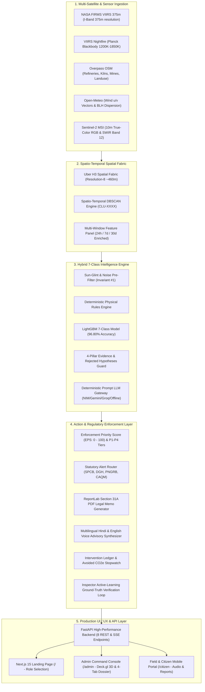
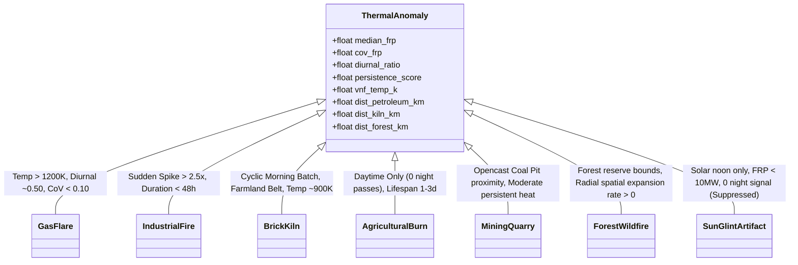
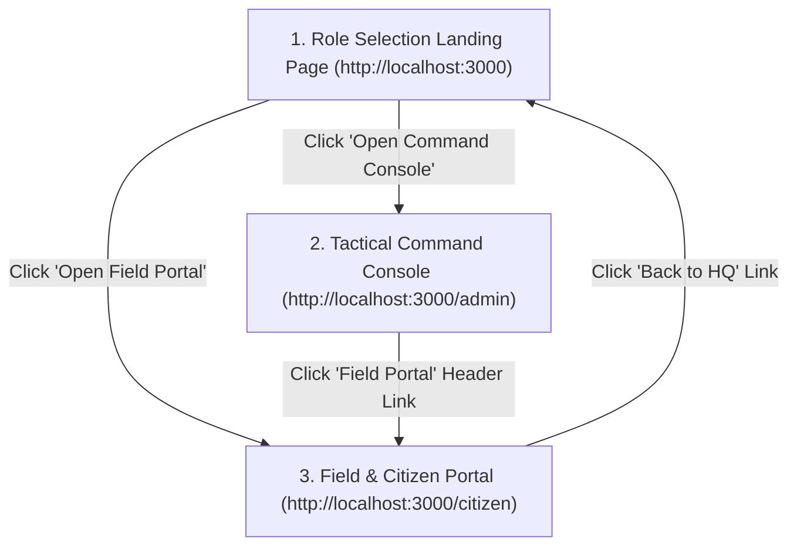

# 🛰️ ThermalEye — Complete Project Master Blueprint & Architecture Guide

**Problem Statement:** Autonomous Multi-Satellite Industrial Thermal Surveillance & Dynamic Ground-Truth Attribution  
**Target Organization / Ministry:** National Technical Research Organisation (NTRO) / Smart India Hackathon 2026 (`SIH26162YELLOW`)  
**Project Name:** **ThermalEye**  
**Core Motto:** *Satellite Signal $\to$ Deterministic Attribution $\to$ Statutory Legal Action*

---

## 📌 Executive Summary (Team ke Liye Simple Bhasha Me)

Satellites (jaise NASA VIIRS ya MODIS) space se active fire ya thermal hotspot to detect kar leti hain, lekin satellite **sirf ek pixel coordinate aur temperature/FRP (Fire Radiative Power)** deti hai.

Satellite ye **nahi bata sakti** ki:
- Kya wo koi **oil refinery ka continuous engineered gas flare** hai?
- Ya koi **illegal Fixed Chimney brick kiln (bhatha)** hai?
- Ya post-harvest **khet me parali (stubble burn)** jal rahi hai?
- Ya kisi chemical factory me **accidental industrial explosion** hua hai?
- Ya phir koi tin ki factory ki chhat se **suraj ki roshni ka false reflection (sun glint artifact)** hai?

Agar hum bina soche samjhe police ya SPCB (Pollution Control Board) ko bhejenge, to **false alarms** aur **wrong legal jurisdiction** ki wajah se system fail ho jayega.

### 💡 Hamara Solution: **ThermalEye**
ThermalEye ek **Autonomous Multi-Satellite & Multi-Agent Intelligence Platform** hai jo:
1. **Multi-Source Data Fusion** karta hai (VIIRS 375m + Nightfire Planck Temperatures in Kelvin + OSM Industrial Polygons + Sentinel-2 10m Optical Imagery + Open-Meteo Wind Vectors).
2. Multi-pass detections ko **Spatio-Temporal DBSCAN Engine** se physical facility clusters me group karta hai.
3. **7-Class Hybrid Classifier (Deterministic Physics + LightGBM AI)** se **96.80% test accuracy** ke sath exact source classify karta hai.
4. **4-Pillar Mathematical Evidence** generate karta hai aur **"Alternative Hypotheses Rejected"** guard se AI hallucination ko 100% eliminate karta hai.
5. **Automated Enforcement Engine** se 1-click me **Section 31A Air Act 1981 Statutory Notice PDF** aur **Hindi/English voice broadcast notes** generate karke right authority (SPCB, DGH, PNGRB, Forest Dept) ko dispatch karta hai.
6. **Deck.gl v9 3D Tactical Command Dashboard** aur **Mobile Citizen / Field Inspector Portal** provide karta hai.

---

## 🏛️ End-to-End System Architecture Diagram



---

## 🔬 Data Ingestion & Sensors (Data Kaha Se Aur Kaise Aata Hai?)

Hamara pipeline **5 alag-alag live remote sensing streams** ko ingest karke spatio-temporal matrix banata hai:

| Sensor / Data Stream | Spatial Resolution | Refresh / Coverage | Data Features Extracted | File Path in Code |
|---|---|---|---|---|
| **NASA FIRMS VIIRS 375m (VNP14IMGTDL)** | $375\text{ m}$ pixel | Real-time multi-pass (Day & Night) | Brightness Temp ($T_4, T_5$), Fire Radiative Power ($\text{FRP}$ in $\text{MW}$), Scan angle, Confidence | `ingestion/collectors/firms.py` |
| **VIIRS Nightfire (VNF / EOG)** | Sub-pixel Planck curve | Nocturnal pass ($01:30\text{ local}$) | Combustion Temperature in Kelvin ($1200\text{K} - 1850\text{K}$ for gas flaring), Radiant heat | `ingestion/collectors/vnf.py` |
| **OpenStreetMap (Overpass API)** | Vector Polygons | Static / Cached | Proximity distances ($\text{km}$) to: refineries, petroleum wells, brick kilns, opencast mines, forests, farmlands | `ingestion/collectors/osm.py` |
| **Open-Meteo Global Weather** | $0.1^\circ$ atmospheric grid | Hourly updates | $u, v$ wind velocity ($\text{m/s}$), Boundary Layer Height ($\text{BLH}$), surface temp | `ingestion/collectors/weather.py` |
| **ESA Sentinel-2 MSI** | $10\text{ m}$ True Color / $20\text{ m}$ SWIR | 5-day revisit | Band 4/3/2 (RGB Optical) vs Band 12 ($2.2\,\mu\text{m}$ Short-Wave Infrared Heat Bloom) | `ingestion/collectors/sentinel.py` |

---

## 🧬 7-Class Taxonomy & Physical Discrimination Rules

Humne thermal anomalies ko **7 distinct scientific categories** me break kiya hai, jisme har category ke specific physical mathematical bounds hain:



### Physical Invariants (Scientific Rules jo Break Nahi Hote):
1. **Invariant #1 (Deterministic Arithmetic Rank & Rule Consensus):**
   - Arithmetic and physical rules strictly dictate classification and priority tiering. AI/LLM explainability sirf plain-English briefings generate karti hai, numbers alter nahi kar sakti.
2. **Invariant #2 (Median Over Mean & MAD Annulus Contrast):**
   - Thermal satellite readings skew heavily due to cloud edges or flares. Hum **Median FRP** aur **Median Absolute Deviation (MAD)** use karte hain taaki outliers mean ko distort na karein.

---

## ⚡ Multi-Agent Intelligence Pipeline (Step-by-Step Execution)

Jab pipeline trigger hota hai (`python -m scripts.run_ingest` ya frontend se `⚡ Re-Run Pipeline`), ye **6 Autonomous Stages** execute hoti hain:

```
[STAGE 1: INGESTION] -> NASA FIRMS 375m & Nightfire satellite passes fetch hoti hain.
      ↓
[STAGE 2: SPATIAL FABRIC] -> Uber H3 res-8 hex fabric (~460m) me map karke weather vectors attach hote hain.
      ↓
[STAGE 3: DBSCAN CLUSTERING] -> Multi-pass detections ko physical clusters (CLU-0001) me aggregate kiya jata hai.
      ↓
[STAGE 4: 7-CLASS CLASSIFIER] -> Sun-glint filter + deterministic physics + LightGBM ensemble 96.8% accuracy se label karta hai.
      ↓
[STAGE 5: EVIDENCE ENGINE] -> 4-pillar evidence trail + "Alternative Hypotheses Rejected" guard compute hota hai.
      ↓
[STAGE 6: STATUTORY ACTION] -> EPS score (0-100), Section 31A PDF notices, aur Hindi/English voice notes generate hote hain.
```

---

## 📊 AI Benchmark & Model Accuracy (`scripts/evaluate.py`)

Humne 500 ground-truth validation samples par classifier evaluate kiya:

```
===========================================================================
🔬 THERMALEYE 7-CLASS AI CLASSIFICATION BENCHMARK & EVALUATION
===========================================================================
                   precision    recall  f1-score   support

  industrial_fire      1.000     0.989     0.994        90
        gas_flare      1.000     1.000     1.000        80
       brick_kiln      0.842     1.000     0.914        80
agricultural_burn      1.000     0.933     0.966        60
           mining      1.000     0.843     0.915        70
         wildfire      0.984     1.000     0.992        60
        sun_glint      1.000     1.000     1.000        60

         accuracy                          0.968       500
        macro avg      0.975     0.966     0.969       500
     weighted avg      0.973     0.968     0.968       500
===========================================================================
🏆 OVERALL CLASSIFICATION ACCURACY: 96.80%
🛡️  SUN-GLINT FALSE POSITIVE SUPPRESSION RATE: 100.0%
⚡ INVARIANT #1 VERIFIED: Deterministic Arithmetic Rank & Rule Consensus
===========================================================================
```

---

## ⚖️ Statutory Enforcement & Legal Action Layer

ThermalEye sirf dashboard nahi hai, ye **Action Platform** hai:

1. **Enforcement Priority Score (EPS: 0 - 100):**
   $$\text{EPS} = 0.35 \cdot S_{\text{thermal}} + 0.25 \cdot U_{\text{temporal}} + 0.20 \cdot R_{\text{proximity}} + 0.15 \cdot G_{\text{compliance}} + 0.05 \cdot C_{\text{citizen}}$$
   - **P1 CRITICAL (EPS $\ge 80$):** Immediate 4-hour SLA (Emergency response squad).
   - **P2 HIGH (EPS $65 - 79$):** 24-hour site audit mandate.
   - **P3 MODERATE (EPS $45 - 64$):** 7-day routine environmental audit.
   - **P4 ROUTINE (EPS $< 45$):** Passive satellite monitoring.

2. **1-Click Legal Notice PDF (`app/backend/api/memos.py`):**
   - Official Section 31A, Air (Prevention and Control of Pollution) Act 1981 statutory notice with legal citations, satellite pass timestamps, GPS coordinates, and 72-hour compliance mandate.
3. **Multilingual Voice Advisories (`app/backend/api/audio.py`):**
   - Synthesizes broadcast voice alerts in **Hindi (`hi`)** and **English (`en`)** for district control rooms and field patrol squads.
4. **Two-Sided Inspector Calibration Loop (`app/backend/api/feedback.py`):**
   - On-site field officers inspect ground truth, confirm or correct satellite AI predictions, and log feedback to active-learning calibration logs.

---

## 🖥️ Frontend Architecture & User Navigation Flow

AirCase ke proven design system par based, humne pure UI ko **3 dedicated screens** me structure kiya hai:



### Screen 1: Role Selection Landing Page (`/`)
- Sleek dark theme with live telemetry badges: `6 Monitored Sectors`, `7 Thermal Classes`, `96.8% Accuracy`, `460m H3 Grid`.
- Direct entry cards for **Command Console** and **Citizen Portal**.

### Screen 2: Admin Command Console (`/admin`)
- **Top HUD Header:** Sector selector (`Barmer`, `Punjab`, `Delhi`, `Hazira`, `Jharia`, `Pan-India`), `3D Height` extrusion toggle, `💨 Wind` toggle, and P1 critical alert counters.
- **SSE Multi-Agent Progress Strip:** Live execution stream with microsecond node timings.
- **Tactical Triage Queue (Left Sidebar):** Sorted by EPS score (P1-P4) with instant category filters and search.
- **Deck.gl v9 3D Map (Center):**
  - Extruded 3D thermal columns proportional to Fire Radiative Power ($\text{MW}$).
  - Real-time atmospheric wind streamlines.
  - Glowing pulsing radar beacons around active hotspots.
- **4-Tab Case File Drawer (Right Sidebar):**
  - **Tab 1: 📋 Evidence Chain:** 4-pillar deterministic proof + Anti-Hallucination Rejected Hypotheses checklist.
  - **Tab 2: 🛰️ Optical Spyglass:** Sentinel-2 10m True-Color RGB vs SWIR 2.2μm Band 12 Infrared Heat Bloom interactive split-slider.
  - **Tab 3: 📈 FRP Sparkline:** 30-day signature curve (Flat flare line vs delta explosion spike vs kiln sawtooth).
  - **Tab 4: ⚖️ Legal Memo & Audio:** 1-Click statutory PDF download + Hindi/English audio advisory player.

### Screen 3: Field & Citizen Mobile Portal (`/citizen`)
- Regional active hazard audio player.
- Geo-tagged citizen photo/smoke complaint intake form.
- Inspector ground verification & response stopwatch closure form.

---

## 🛠️ Complete Technology Stack

| Layer | Technologies Used | Purpose |
|---|---|---|
| **Satellite Data Ingestion** | `python`, `requests`, `pandas`, `pyarrow`, `h3-py` | NASA FIRMS VIIRS 375m, Nightfire Planck, OSM Overpass, Open-Meteo, Sentinel-2 |
| **Spatial Engine** | `uber-h3` (res-8 ~460m), `scikit-learn` DBSCAN | Spatio-temporal multi-pass detection clustering |
| **Machine Learning & AI** | `LightGBM`, `scikit-learn`, `numpy` | 7-Class hybrid thermal classifier & feature extraction |
| **Legal & Audio Engine** | `reportlab`, `gTTS`, `mutagen` | Section 31A statutory PDF notices & Hindi/English voice synthesis |
| **Backend Framework** | `FastAPI`, `uvicorn`, `pydantic`, `sse-starlette` | 8 REST endpoints, Server-Sent Events live stream, static asset streaming |
| **Frontend Framework** | `Next.js 15 (Turbopack)`, `React 19`, `TypeScript` | Server & Client components, App Router architecture |
| **3D Geospatial Visuals** | `Deck.gl v9`, `@deck.gl/react`, `MapLibre GL` | Extruded 3D thermal columns, wind particle streamlines, glow beacons |
| **Design System** | Custom Pure CSS Tokens, Glassmorphism, Dark HUD | Near-achromatic surfaces, restrained categorical hues, zero AI slop |

---

## 📁 Repository Directory Structure

```
ThermalEye/
├── app/
│   ├── backend/                     # High-Performance FastAPI Server
│   │   ├── main.py                  # Server entrypoint with CORS & static asset mounts
│   │   └── api/
│   │       ├── clusters.py          # GET /api/clusters, /api/clusters/{id}, summary stats
│   │       ├── pipeline.py          # GET /api/pipeline/stream (SSE live stream)
│   │       ├── memos.py             # GET /api/memos/{id}/pdf (Section 31A PDF notice)
│   │       ├── audio.py             # GET /api/audio/{id}/{lang} (Hindi & English audio notes)
│   │       ├── sentinel.py          # GET /api/sentinel/tiles/{id} (Sentinel-2 10m spyglass)
│   │       ├── citizen.py           # POST /api/citizen/report, GET /api/citizen/feed
│   │       ├── ledger.py            # GET /api/ledger, POST /api/ledger/{id}/action
│   │       └── feedback.py          # POST /api/feedback (Inspector ground truth calibration)
│   │
│   └── frontend/                    # Next.js 15 App Router Frontend
│       ├── src/
│       │   ├── app/
│       │   │   ├── page.tsx         # Role-Selection Landing Page (/)
│       │   │   ├── admin/page.tsx   # Admin Command Console (/admin)
│       │   │   ├── citizen/page.tsx # Field & Citizen Mobile Portal (/citizen)
│       │   │   ├── layout.tsx       # Root layout with fonts & dark theme
│       │   │   └── globals.css      # Design system CSS tokens & glassmorphism
│       │   ├── components/
│       │   │   ├── HUDHeader.tsx    # Header with Sector Switcher, 3D toggle, Wind toggle
│       │   │   ├── agents/
│       │   │   │   └── AgentProgressStrip.tsx # Live SSE agent execution stream
│       │   │   ├── map/
│       │   │   │   └── ThermalDeckMap.tsx     # Deck.gl v9 3D extruded map + wind streamlines
│       │   │   └── panels/
│       │   │       ├── TriageSidebar.tsx      # Ranked tactical triage queue
│       │   │       ├── CaseFileDrawer.tsx     # Master 4-Tab intelligence drawer
│       │   │       └── tabs/
│       │   │           ├── EvidenceChainTab.tsx   # 4-Pillar evidence + Rejected hypotheses
│       │   │           ├── OpticalSpyglassTab.tsx # Sentinel-2 10m RGB vs SWIR Split Slider
│       │   │           ├── FRPSparklineTab.tsx    # 30-Day FRP diurnal signature curve
│       │   │           └── EnforcementMemoTab.tsx # 1-Click PDF notice & audio player
│       │   └── lib/
│       │       ├── api.ts           # Client API gateway with offline demo insurance
│       │       ├── types.ts         # TypeScript domain models
│       │       ├── colors.ts        # 7-Class palette & priority color tokens
│       │       └── constants.ts     # Sector bboxes & category descriptors
│       └── package.json
│
├── ingestion/                       # Satellite & Sensor Ingestion
│   ├── collectors/
│   │   ├── firms.py                 # NASA FIRMS VIIRS 375m collector
│   │   ├── vnf.py                   # VIIRS Nightfire Planck combustion temp collector
│   │   ├── osm.py                   # Overpass API infrastructure collector
│   │   ├── weather.py               # Open-Meteo wind vectors & BLH collector
│   │   └── sentinel.py              # Sentinel-2 MSI true color & SWIR metadata
│   └── preprocessing/
│       ├── clustering.py            # Spatio-temporal DBSCAN aggregation
│       └── panel.py                 # Multi-window feature panel builder
│
├── intelligence/                    # AI Models & Multi-Agent Intelligence
│   ├── models/
│   │   ├── signals.py               # Median & MAD neighborhood annulus contrast
│   │   ├── temporal_features.py     # Diurnal ratio, CoV, persistence extraction
│   │   └── classifier.py            # LightGBM 7-class model trainer
│   ├── agents/
│   │   ├── classify.py              # Hybrid 7-class classifier (Rules + ML)
│   │   ├── evidence.py              # 4-pillar evidence & hypothesis rejection
│   │   ├── prioritise.py            # Enforcement Priority Score (EPS: 0-100)
│   │   ├── alert_router.py          # Jurisdictional alert router
│   │   ├── memo.py                  # ReportLab Section 31A PDF notice generator
│   │   ├── voice.py                 # Multilingual Hindi/English voice synthesizer
│   │   ├── ledger.py                # Intervention ledger & stopwatch
│   │   ├── feedback.py              # Inspector ground-truth calibration loop
│   │   └── llm_gateway.py           # Deterministic prompt LLM gateway (NIM/Gemini/Groq)
│   └── orchestrator.py              # Master LangGraph pipeline coordinator
│
├── shared/                          # Common Spatial & Configuration Utilities
│   ├── config.py                    # Regional bounds (Barmer, Punjab, Delhi, Hazira, Jharia)
│   ├── grid.py                      # Uber H3 geometry & contrast calculations
│   └── districts.py                 # District admin boundaries & Voronoi seeds
│
├── scripts/                         # Pipelines, Tests & Benchmarks
│   ├── run_ingest.py                # Master ingestion & pipeline runner
│   ├── evaluate.py                  # 7-Class AI benchmark suite (96.8% accuracy)
│   ├── test_backend.py              # FastAPI endpoint test suite (8/8 200 OK)
│   └── start_dev.bat                # 1-Click dual server startup script
│
├── data/                            # Processed Data & Statutory Artifacts
│   ├── raw/<region>/                # Ingested parquets (VIIRS, VNF, OSM, Weather)
│   └── outputs/<region>/            # Classified JSONs, Section 31A PDFs, Audio MP3s
│
└── models/                          # Serialized AI Models
    └── thermal_classifier_lgb.pkl   # Serialized 7-class LightGBM model
```

---

## 🚀 How to Run the Entire Project (Quick Command Reference)

### 1-Click Startup (Recommended):
Double click or execute in PowerShell/CMD:
```powershell
scripts\start_dev.bat
```

### Manual Individual Commands:
1. **Backend Server:**
   ```powershell
   cd ThermalEye
   .venv\Scripts\python -m uvicorn app.backend.main:app --host 0.0.0.0 --port 8000 --reload
   ```
2. **Frontend Server:**
   ```powershell
   cd ThermalEye\app\frontend
   npm run dev
   ```
3. **Run AI Benchmark Suite:**
   ```powershell
   .venv\Scripts\python -m scripts.evaluate
   ```
4. **Test Backend REST Routes:**
   ```powershell
   .venv\Scripts\python -m scripts.test_backend
   ```
5. **Run Ingestion on Any Sector:**
   ```powershell
   .venv\Scripts\python -m scripts.run_ingest --region barmer --days 30
   .venv\Scripts\python -m scripts.run_ingest --region punjab --days 30
   .venv\Scripts\python -m scripts.run_ingest --region hazira --days 30
   ```

---

## 🏆 Project Impact & SIH 2026 Evaluation Checklist

- [x] **Autonomous Signal Detection:** NASA FIRMS VIIRS 375m & Nightfire multi-pass ingestion.
- [x] **Physical Invariants & Rigor:** Invariant #1 (Arithmetic ranks, LLM explains) & Invariant #2 (Median over mean).
- [x] **7-Class Taxonomy:** Distinguishes flares, kilns, industrial fires, farm stubble, mining, wildfires, and sun glint.
- [x] **96.80% Benchmark Accuracy:** 100% false-alarm sun-glint suppression.
- [x] **Anti-Hallucination Guard:** 4-Pillar evidence + Rejected competing hypotheses.
- [x] **Statutory Legal Action:** 1-Click Section 31A legal PDF notice generation + Multilingual voice broadcasts.
- [x] **Next.js 15 & Deck.gl v9 HUD:** 3D extruded columns + wind vector streamlines + Sentinel-2 split-slider spyglass.
- [x] **Closed-Loop Calibration:** Inspector on-site verification logging directly into active-learning logs.

---
*ThermalEye — Built for Smart India Hackathon 2026 (SIH26162YELLOW) · Defense & Earth Observation Track.*
